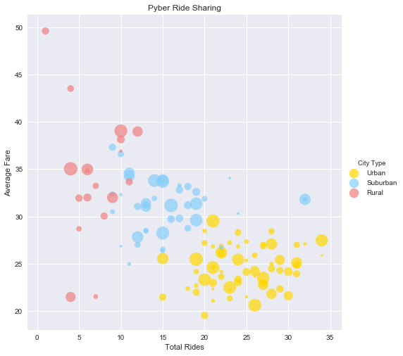
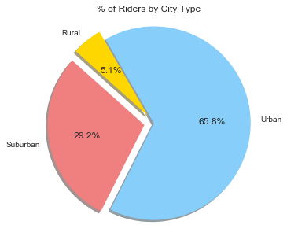
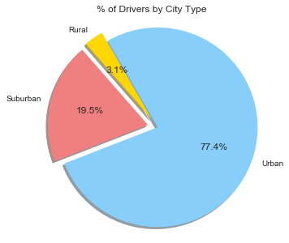

# Pyber Ride Sharing
Fare is directly related to the amount of rides. Example: Rural areas, with less riders has the highest average fare
Fare is directly related to the amound of drivers. Competition drives down fare prices
Pyber demand correlates with population density


```python
import numpy as np
import pandas as pd
import seaborn as sns
from scipy import stats
import matplotlib as mpl
import matplotlib.pyplot as plt
```


```python
# Import CSV
ride_df = pd.read_csv("ride_data.csv")
city_df = pd.read_csv("city_data.csv")
```


```python
# Average Fare ($) Per City 
City_Stats = ride_df.groupby(['city'])
Average_Fare = City_Stats[['fare']].mean().reset_index()
Average_Fare['fare']=Average_Fare['fare']#.map("${0:,.2f}".format)

# Total Number of Rides Per City
Rider_Total = City_Stats[['ride_id']].count().reset_index()

# Total Number of Drivers Per City
Driver_Total = city_df[['city','driver_count']]

# City Type (Urban, Suburban, Rural)
City_Type = city_df[['city','type']]
```


```python
# Merge into one data frame
merge_one = Average_Fare.merge(Rider_Total,  on = 'city', how='outer')
merge_two = Driver_Total.merge(City_Type, on = 'city', how = 'outer')
merge_three = merge_one.merge(merge_two, on = 'city', how = 'outer')
merge_three.columns = ['City','Average Fare','Total Rides','Total Drivers','City Type']
merge_three.head()
```


<div>
<style>
    .dataframe thead tr:only-child th {
        text-align: right;
    }

    .dataframe thead th {
        text-align: left;
    }

    .dataframe tbody tr th {
        vertical-align: top;
    }
</style>
<table border="1" class="dataframe">
  <thead>
    <tr style="text-align: right;">
      <th></th>
      <th>City</th>
      <th>Average Fare</th>
      <th>Total Rides</th>
      <th>Total Drivers</th>
      <th>City Type</th>
    </tr>
  </thead>
  <tbody>
    <tr>
      <th>0</th>
      <td>Alvarezhaven</td>
      <td>23.928710</td>
      <td>31</td>
      <td>21</td>
      <td>Urban</td>
    </tr>
    <tr>
      <th>1</th>
      <td>Alyssaberg</td>
      <td>20.609615</td>
      <td>26</td>
      <td>67</td>
      <td>Urban</td>
    </tr>
    <tr>
      <th>2</th>
      <td>Anitamouth</td>
      <td>37.315556</td>
      <td>9</td>
      <td>16</td>
      <td>Suburban</td>
    </tr>
    <tr>
      <th>3</th>
      <td>Antoniomouth</td>
      <td>23.625000</td>
      <td>22</td>
      <td>21</td>
      <td>Urban</td>
    </tr>
    <tr>
      <th>4</th>
      <td>Aprilchester</td>
      <td>21.981579</td>
      <td>19</td>
      <td>49</td>
      <td>Urban</td>
    </tr>
  </tbody>
</table>
</div>


```python
# Set style of scatterplot
colors = ["gold", "lightcoral", "lightskyblue"]
sns.set()
# Create scatterplot of dataframe
sns.lmplot('Total Rides', # Horizontal axis
           'Average Fare', # Vertical axis
           data=merge_three, # Data source
           fit_reg=False, # Don't fix a regression line
           hue= "City Type",
           size =7,
           aspect =1,
           palette=dict(Urban="gold", Suburban="lightskyblue",Rural = "lightcoral"),
           scatter_kws={"marker": "o", "alpha":.7,"s":(merge_three['Total Drivers']*5)}) # S marker size, multiplied for visual impact

# Set title
plt.title('Pyber Ride Sharing')

# Set x-axis label
plt.xlabel('Total Rides')

# Set y-axis label
plt.ylabel('Average Fare')
plt.show()
```





```python
city_type = merge_three.groupby(["City Type"]).sum().reset_index()

```


```python
labels = city_type['City Type']
ave_fare = city_type['Average Fare']
tot_ride = city_type['Total Rides']
tot_drive = city_type['Total Drivers']
colors = ["gold", "lightcoral", "lightskyblue"]
explode = (0.1, .1, 0) 
```

# TOTAL FARE BY CITY TYPE


```python
plt.figure(figsize=(5,5))
x = ave_fare
plt.title("% of Total Fares by City Type") 
plt.pie(x, explode=explode, labels=labels, colors=colors,
        autopct="%1.1f%%", shadow=True, startangle=120)
plt.axis("equal")
plt.show()
```


# TOTAL RIDES BY CITY TYPE


```python
# RIDERS BY CITY TYPE
plt.figure(figsize=(5,5))
x = tot_ride
plt.title("% of Riders by City Type")
plt.pie(x, explode=explode, labels=labels, colors=colors,
        autopct="%1.1f%%", shadow=True, startangle=120)
plt.axis("equal")
plt.show()
```





# TOTAL DRIVERS BY CITY TYPE


```python
# DRIVERS BY CITY TYPE
plt.figure(figsize=(5,5))
x = tot_drive
plt.title("% of Drivers by City Type")
plt.pie(x, explode=explode, labels=labels, colors=colors,
        autopct="%1.1f%%", shadow=True, startangle=120)
plt.axis("equal")
plt.show()
```




